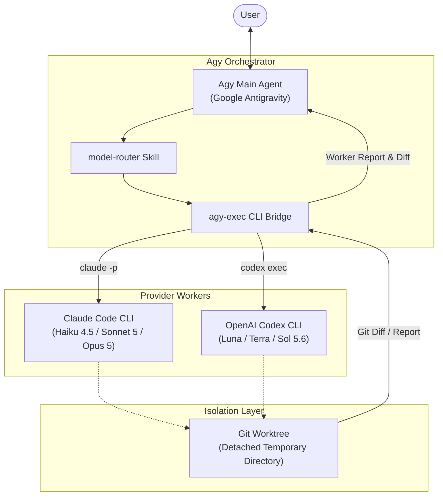

# Agy Orchestrator

[English](README.md) | [繁體中文](README.zh-TW.md)

**Agy Orchestrator** is a cost-aware, cross-provider orchestration layer for **Google Antigravity (Agy)**.

Agy acts as the primary orchestrator agent—handling task decomposition, plan coordination, and final code integration—while delegating software-engineering subtasks to **Claude Code** and **OpenAI Codex** worker models via the `agy-exec` bridge.

---

## Why Agy Orchestrator?

1. **Cross-Provider Model Diversity**: Agy subagents normally expose platform tiers (`inherit`, `flash`, `pro`). Agy Orchestrator bridges Agy to arbitrary external model IDs across Anthropic Claude (`Haiku`, `Sonnet`, `Opus`) and OpenAI Codex (`Luna`, `Terra`, `Sol`).
2. **Cost-Aware Escalation**: Avoid running high-cost flagship models for entire tasks. Cheap models handle discovery, file search, and test triage; mid-tier models handle primary implementation; and expert models are only invoked for difficult architecture decisions or when lower tiers encounter blockers.
3. **Workspace Isolation via Git Worktree**: External workers execute inside isolated, detached Git worktrees by default. They cannot overwrite your working tree directly. Agy reviews reported diffs as proposals and integrates only verified changes.
4. **Independent Cross-Family Review**: Code authored by Claude models can be reviewed by OpenAI models (and vice versa) to eliminate model family blind spots.

---

## Architecture



---

## Routing Ladder & Model Matrix

| Work Type | First Choice | Alternate | Escalation / Expert |
|---|---|---|---|
| File discovery, grep plan, docs, boilerplate, simple checks | **Luna** (GPT-5.6) | **Haiku** (Claude 4.5) | Terra |
| Quick codebase exploration, tests, triage | **Haiku** (Claude 4.5) | **Luna** (GPT-5.6) | Sonnet |
| Normal implementation, refactoring, standard debugging | **Sonnet** (Claude 5) | **Terra** (GPT-5.6) | Opus / Sol |
| OpenAI-family implementation or cross-review | **Terra** (GPT-5.6) | **Sonnet** (Claude 5) | Sol |
| Difficult architecture, ambiguous requirements, hard bugs | **Opus** (Claude 5) | **Sol** (GPT-5.6) | Dual Cross-Review |
| Deep reasoning, cross-file verification, race conditions | **Sol** (GPT-5.6) | **Opus** (Claude 5) | Dual Cross-Review |

---

## Repository Structure

```text
agy-orchestrator/
├── bin/
│   ├── agy-exec                       # Core CLI execution bridge
│   └── agy-audit                      # Forensics over Agy's own trajectory files
├── agy/
│   ├── agents/
│   │   ├── agy-orchestrator/
│   │   │   └── agent.md               # Main orchestrator agent definition
│   │   └── agy-worker/
│   │       └── agent.md               # Generic worker subagent (fallback)
│   ├── templates/
│   │   └── worker.md                  # Source for the per-route worker agents
│   │                                  #   install.sh renders it into
│   │                                  #   haiku/ sonnet/ opus/ luna/ terra/ sol/
│   └── skills/
│       └── model-router/
│           └── SKILL.md               # Model routing skill definition
├── config/
│   └── models.env                     # Model ID mapping & budget configuration
├── examples/
│   └── task-prompts.md                # Real-world prompt examples
├── install.sh                         # Automated installer
├── uninstall.sh                       # Uninstaller
├── README.md                          # English documentation
├── README.zh-TW.md                    # Traditional Chinese documentation
└── .gitignore                         # Git ignore patterns
```

---

## Real-Time Subagent Statusline

When `agy-orchestrator` delegates, it dispatches via `invoke_subagent` with TypeName set to
the **route name** — `haiku`, `sonnet`, `opus`, `luna`, `terra`, or `sol`. Each route has its
own worker agent, rendered by `install.sh` from `agy/templates/worker.md`.

This exists because the Agy statusline renders the subagent's **TypeName**, not its `Role`.
A single shared worker would show every delegation as `Agent(agy-worker)`, leaving the user
unable to tell which external model is running. Per-route agents make it read:

```text
● Agent(sonnet)  sonnet 執行中 · 1m11s
● Agent(terra)   terra 執行中 · 2m32s
```

- **Real-Time Display**: the routed model appears directly in the Agy CLI bottom bar.
- **Progress & Metrics**: active model, elapsed running time, and current tool call.
- **Concurrent Tracking**: parallel workers are shown side by side.

TypeName must match the `--model` value in the `agy-exec` command. `agy-worker` remains as a
fallback for routes without a dedicated agent.

Because route names are ordinary words, `install.sh` never overwrites an agent it did not
generate (it looks for an `agy-orchestrator:generated` marker), and `uninstall.sh` removes
only marked ones.

---

## Worker Report Contract

`agy-exec` runs for minutes. The `agy-worker` subagent that dispatches it is a cheap
`flash_lite` runner, so its natural failure mode is impatience: seeing `RUNNING`, doing
the task itself, and relaying its own output as if the routed model had produced it. A
fabricated "review passed" is indistinguishable from a real one until the real report
arrives minutes later and contradicts it.

Every completed run therefore ends with a sentinel as its final line:

```text
===== AGY_WORKER_END exit=0 =====
```

`agy-exec` also exits with the worker's own exit code, so a failed worker fails the
bridge instead of silently reporting success.

A worker report is only valid when it carries:
- `===== AGY_WORKER_END exit=0 =====`;
- the `🚀 [agy-worker] Starting:` banner naming the routed model;
- an `AGY_WORKER_GIT_DIFF` block, for `--mode edit` tasks.

The orchestrator must not integrate, commit, or treat a review as passed without them.

---

## Auditing what the orchestration actually did

`agy-exec` records what each worker did. `agy-audit` answers the other half: did the
*orchestrator* behave like an orchestrator? It reads the Antigravity CLI's own trajectory
files under `~/.gemini/antigravity-cli/brain/` and talks to no model.

```bash
agy-audit                 # report on the last 30 minutes
agy-audit --window 3600   # ... the last hour
agy-audit --watch         # stream one line per NEW event, for a background monitor
```

Three families of check, each written against a failure that actually happened here:

**Worker contract.** `agy-worker` is a cheap dispatch runner meant to launch one
`agy-exec` command and relay its output. Its characteristic failure is impatience: it
sees `RUNNING`, decides the command is too slow, does the task itself, and presents its
own output as the routed model's report. Once, a commit landed on a review that was
written that way and only contradicted minutes later by the real one. So the audit flags
any command outside the sanctioned set, and any report sent with no completion sentinel
in the run's logs.

**Delegation shape.** `--isolation shared` on an edit task defeats worktree isolation. A
`TypeName` that does not match `--model` makes the statusline name the wrong model. A
dispatch prompt missing the sentinel contract invites the impatience failure above.

**Routing ladder.** The ladder's whole point is that a cheap route failing escalates to a
stronger one. The quiet way it breaks is the orchestrator absorbing the work itself after
a failure — the ladder never moves, and a `pro` main agent does the job a routed model
should have. No per-event check can see this; it only appears when you correlate a
failure with what happened next:

```text
🔴 [06a56e2c] 梯子斷裂：sonnet 路由失敗後未再委派，主控自行編輯 6 次收尾
🪜 [xxxxxxxx] 升級生效：sonnet(主力) 失敗 → opus(專家)
🟠 [xxxxxxxx] 同層同路由重試：sonnet 失敗後又派 sonnet
```

Expert routes used as reviewers are exempt from the "expert without a failed cheaper
attempt" rule, since cross-family review is prescribed policy rather than a skipped rung.

---

## Prerequisites & Installation

### Requirements
- **Google Antigravity (Agy) CLI**
- **Claude Code CLI** (`claude`), authenticated
- **OpenAI Codex CLI** (`codex`), authenticated
- Git recommended for worktree isolation

### Quick Install
```bash
git clone https://github.com/tern/agy-orchestrator.git
cd agy-orchestrator
./install.sh
```

Ensure `~/.local/bin` is in your `PATH` (e.g., in `~/.zshrc`):
```bash
export PATH="$HOME/.local/bin:$PATH"
```

The installer configures:
- `~/.local/bin/agy-exec` (executable bridge)
- `~/.gemini/config/agents/agy-orchestrator/agent.md` (Agy agent)
- `~/.gemini/config/skills/model-router/SKILL.md` (Agy skill)
- `~/.config/agy-orchestrator/models.env` (model aliases & budget limits)

---

## Smoke Tests

Verify CLI bridge execution directly from your terminal:

```bash
# Test Claude Haiku (inspect mode)
agy-exec --model haiku --mode inspect --task "Say which model route you are and do not modify files."

# Test OpenAI Luna (inspect mode)
agy-exec --model luna --mode inspect --task "Inspect this repository at a high level and list its top-level purpose."
```

---

## CLI Reference (`agy-exec`)

```text
agy-exec --model <haiku|sonnet|opus|luna|terra|sol> --task <text> [options]
agy-exec apply <run-id> [--cwd <path>] [--check] [-- <file>...]
agy-exec runs [--task-id <id>] [--limit <n>]

Delegate options:
  --model <name>               Model alias (haiku|sonnet|opus|luna|terra|sol)
  --task <text>                Task prompt for the worker
  --cwd <path>                 Working directory (default: pwd)
  --role <text>                Worker role label (e.g., research, implementation, review)
  --mode <inspect|edit>        inspect = read-only; edit = write-capable
  --isolation <worktree|shared> Default: worktree for Git repos, shared otherwise
  --task-id <id>               Budget/ledger grouping key for one unit of work
                               (default: <repo-basename>-<YYYYMMDD>)
  --output <path>              Save worker text output to a file
  --keep-worktree              Keep temporary worktree for manual inspection
  -h, --help                   Show help message
```

### Result contract

Every run records `~/.local/share/agy-orchestrator/runs/<run-id>/` with `result.json`,
`worker.diff` and `worker.txt`, appends one line to `runs/<date>.jsonl`, and prints the
result path as `===== AGY_WORKER_RESULT <path> =====` just before the sentinel.

```json
{
  "run_id": "20260904-170556-haiku-32e1",
  "task_id": "PAY-123",
  "ok": true,
  "exit": 0,
  "route": "haiku",
  "provider": "claude",
  "mode": "edit",
  "isolation": "worktree",
  "max_turns": 60,
  "cost_usd": 0.0388,
  "turns": 4,
  "session_id": "...",
  "stop_reason": "end_turn",
  "changed_files": ["greet.txt"],
  "diff_path": ".../worker.diff",
  "report_path": ".../worker.txt"
}
```

**Take control decisions from this file, not from the prose report.** Whether the run
finished, what it touched and what it cost are facts a worker cannot fabricate; a
convincing report about work that never happened is exactly the failure this guards
against. The prose still carries the content — findings, diagnosis, recommendation.

Codex routes do not report USD, so `cost_usd` is `null` for them and they are not counted
against the task budget.

### Task budget

`CLAUDE_BUDGET_*` caps a single call. `AGY_TASK_BUDGET_USD` caps the **sum** of every call
sharing a `--task-id`, which is what stops one goal from escalating through five routes
and spending five times the "limit". `agy-exec` clamps each call to the remaining balance
and exits `3` once the budget is gone:

```text
🛑 task budget exhausted for task-id 'PAY-123': spent $10.02 of $10.00
   Raise AGY_TASK_BUDGET_USD in ~/.config/agy-orchestrator/models.env, or start a new --task-id.
```

`agy-exec runs --task-id PAY-123` lists the runs and the spend so far.

### Applying worker changes

An edit worker's worktree is discarded when it finishes, but its diff is preserved.
Integrate it explicitly rather than retyping the edit:

```bash
agy-exec apply <run-id> --check    # dry run
agy-exec apply <run-id>            # three-way merge, staged, never committed
```

`apply` refuses by default when the run failed (`ok: false`), when it was an `inspect`
run, when it ran with shared isolation (its diff is tree state, not worker output), or
when the target has uncommitted changes — a dirty target makes a conflict unattributable.
`--force` overrides each of these.

On conflict it exits non-zero and stops. Note that `git apply --3way` is **not atomic**:
cleanly merged files stay staged and conflicted ones keep their markers. Resolve them, or
`git reset --hard` to discard the whole attempt.

### Safety notes

- The worker diff is captured through a scratch index, so a run never touches the index of
  the directory it was pointed at. An earlier version staged and reset it, which silently
  discarded whatever the user had staged.
- `--mode edit` with `--isolation shared` is refused inside a Git repository, since that
  combination writes straight into the caller's tree. `--allow-shared-edit` overrides.
- Budget reservations are taken under a lock and released when the real cost is recorded,
  so parallel workers cannot each claim the same remaining balance.

---

## Using in Antigravity (Agy)

1. Restart Antigravity CLI or IDE.
2. Run `/agents` and select **`agy-orchestrator`**.
3. Use a prompt adopting the routing policy:

```text
Use the orchestrator routing policy. Complete the requested change with cost-aware delegation. Use Luna/Haiku for cheap discovery and tests, Sonnet/Terra for primary implementation and debugging, and only escalate to Opus/Sol when lower tiers fail or expert reasoning is clearly necessary. Use independent cross-family review for important changes and verify the final state in the main workspace.
```

See [`examples/task-prompts.md`](examples/task-prompts.md) for more scenario templates.

---

## Model Aliases & Budget Configuration

Edit your configuration anytime in:
```text
~/.config/agy-orchestrator/models.env
```

When providers rename models, simply update the IDs in this file. No changes to scripts or agent definitions are required.

### Turn budgets

Claude workers get a turn budget tiered by `--mode`, because the two modes do different
amounts of work: an inspect worker reads and reports, while an edit worker also changes
files, runs clippy/tests and reacts to the results. One shared cap starves the edit path.

```ini
CLAUDE_MAX_TURNS_INSPECT=20
CLAUDE_MAX_TURNS_EDIT=60
```

A worker that runs out ends with `Error: Reached max turns (N)` and
`===== AGY_WORKER_END exit=1 =====`, and `agy-exec` prints which variable to raise. If it
keeps happening on edit tasks, either raise `CLAUDE_MAX_TURNS_EDIT` or split the task into
smaller delegations. The banner shows the applied budget on every Claude run:

```text
   Mode:       edit
   Max turns:  60 (mode=edit)
```

The older single `CLAUDE_MAX_TURNS` is ignored; `agy-exec` warns if it is still set.

---

## Codex Sandbox Note

The bridge uses `--sandbox workspace-write` inside the isolated temporary worktree for Codex workers. This avoids tool-provisioning regressions observed in some Codex CLI versions when using `read-only` mode, while the ephemeral worktree guarantees full containment against unauthorized repository modifications.

---

## Uninstallation

To remove installed files:
```bash
./uninstall.sh
```
*Note: `~/.config/agy-orchestrator/models.env` is preserved so your custom configurations are not lost.*

---

## References

- [Google Antigravity Documentation](https://www.agy.dev)
- [Claude Code CLI Documentation](https://code.claude.com/docs)
- [OpenAI Codex CLI](https://github.com/openai/codex)
