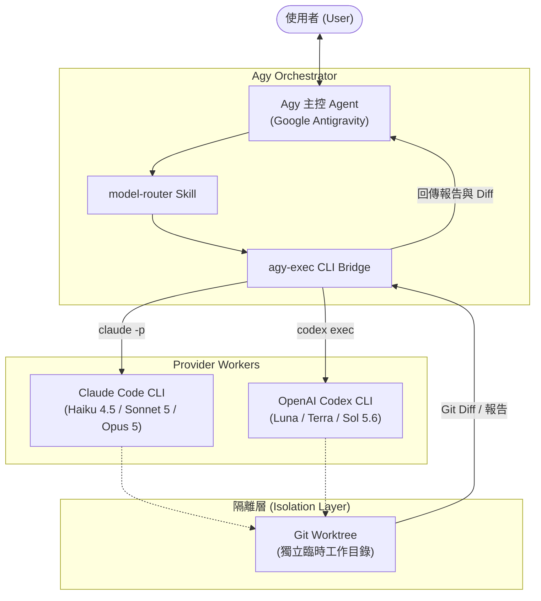

# Agy Orchestrator

[English](README.md) | [繁體中文](README.zh-TW.md)

**Agy Orchestrator** 是一個專為 Google Antigravity (Agy) 設計的**跨模型、注重成本效益 (Cost-Aware) 的軟體工程編排層**。

它讓 Agy 保持為主控 Agent (Main Agent)，負責規劃任務拆解、工作流協調與最後的程式碼整合，並透過 `agy-exec` 橋接器將特定的軟體工程子任務分派給 **Anthropic Claude Code** 或 **OpenAI Codex** 的不同模型。

---

## 為什麼需要 Agy Orchestrator？

1. **突破單一供應商限制**：Agy 內建的 subagent 主要提供層級（如 `inherit`、`flash`、`pro`）。透過本專案的 `model-router` skill 與 `agy-exec` 橋接器，Agy 可以靈活調度 Claude (Haiku / Sonnet / Opus) 與 OpenAI (Luna / Terra / Sol)。
2. **極致成本效益 (Cost-Aware Routing)**：大任務不需要全程使用昂貴的旗艦模型。初期的程式碼搜尋、調查由低成本模型進行，主力開發交給中階模型，唯有遇到疑難架構或卡關時才升級至專家模型。
3. **工作區安全隔離 (Git Worktree Isolation)**：所有外派 worker 預設在獨立的暫存 Git Worktree 中執行，不會直接污染或修改你主要工作區的檔案。Agy 僅檢視 worker 產生的 diff 與驗證報告，以提案方式審核合併。
4. **跨模型家族交叉審查 (Cross-Family Review)**：Claude 撰寫的程式碼可交由 OpenAI 模型審查，反之亦然，有效消除單一模型盲點。

---

## 系統架構



---

## 模型階梯與路由策略 (Routing Ladder)

| 任務類型 | 首選模型 | 備選模型 | 升級 / 專家模型 |
|---|---|---|---|
| 程式碼搜尋、Grep 計畫、文件、樣板、簡易測試 | **Luna** (GPT-5.6) | **Haiku** (Claude 4.5) | Terra |
| 快速程式碼探索、初步分類、單元檢查 | **Haiku** (Claude 4.5) | **Luna** (GPT-5.6) | Sonnet |
| 主力功能實作、重構、一般 Bug 排除 | **Sonnet** (Claude 5) | **Terra** (GPT-5.6) | Opus / Sol |
| OpenAI 體系主力實作、雙向交叉審查 | **Terra** (GPT-5.6) | **Sonnet** (Claude 5) | Sol |
| 複雜架構設計、模糊規格、困難問題排查 | **Opus** (Claude 5) | **Sol** (GPT-5.6) | 交叉雙審查 |
| 深度邏輯推理、跨檔案系統性審查與驗證 | **Sol** (GPT-5.6) | **Opus** (Claude 5) | 交叉雙審查 |

---

## 專案結構

```text
agy-orchestrator/
├── bin/
│   └── agy-exec                       # 核心 CLI 橋接執行檔
├── agy/
│   ├── agents/
│   │   ├── agy-orchestrator/
│   │   │   └── agent.md               # Agy Orchestrator 主控 Agent 定義檔
│   │   └── agy-worker/
│   │       └── agent.md               # 通用 Worker Subagent（後備）
│   ├── templates/
│   │   └── worker.md                  # 各路由 Worker Agent 的來源模板
│   │                                  #   install.sh 渲染為
│   │                                  #   haiku/ sonnet/ opus/ luna/ terra/ sol/
│   └── skills/
│       └── model-router/
│           └── SKILL.md               # model-router Skill 定義檔
├── config/
│   └── models.env                     # 模型別名與預算映射設定檔範本
├── examples/
│   └── task-prompts.md                # 各情境範例 Prompt
├── install.sh                         # 一鍵安裝腳本
├── uninstall.sh                       # 移除腳本
├── README.md                          # 英文說明文件
├── README.zh-TW.md                    # 繁體中文說明文件
└── .gitignore                         # Git 忽略清單
```

---

## 下方即時狀態列 (Subagent StatusLine)

主控 Agent 派發任務時，會以 `invoke_subagent` 派發，並將 TypeName 設為**路由名稱**——
`haiku`、`sonnet`、`opus`、`luna`、`terra` 或 `sol`。每個路由都有專屬的 worker agent，
由 `install.sh` 從 `agy/templates/worker.md` 渲染產生。

之所以這樣設計，是因為 Agy 狀態列渲染的是 subagent 的 **TypeName**，而不是 `Role`。
若共用單一 worker，每次委派都只會顯示 `Agent(agy-worker)`，使用者無從得知實際跑的是哪個
外部模型。改成各路由專屬 agent 後，狀態列會顯示：

```text
● Agent(sonnet)  sonnet 執行中 · 1m11s
● Agent(terra)   terra 執行中 · 2m32s
```

- **即時顯示**：CLI 下方直接顯示實際路由到的模型。
- **進度追蹤**：目前由哪個模型負責、運行耗時與當前工具調用。
- **並行監控**：多個 Worker 同時執行時並列顯示。

TypeName 必須與 `agy-exec` 命令中的 `--model` 值一致。`agy-worker` 保留為沒有專屬 agent
的路由之後備。

由於路由名稱是通用字詞，`install.sh` 不會覆寫非本專案產生的同名 agent（以
`agy-orchestrator:generated` 標記判斷），`uninstall.sh` 也只移除帶標記者。

---

## Worker 回報契約 (Report Contract)

`agy-exec` 動輒執行數分鐘，而負責派發它的 `agy-worker` 是低成本的 `flash_lite` runner，
天然的失效模式就是「等不及」：看到 `RUNNING` 就自己把任務做一遍，再把自己的產出當成
被路由模型的報告回傳。偽造的「審查通過」跟真的長得一模一樣——直到數分鐘後真報告回來
並且結論相反。

因此每次完整執行的最後一行必定是哨符：

```text
===== AGY_WORKER_END exit=0 =====
```

`agy-exec` 同時會以 worker 自身的離開碼結束，失敗的 worker 會讓橋接層一起失敗，不再
靜默回報成功。

一份 worker 報告唯有同時具備以下三者才算有效：
- `===== AGY_WORKER_END exit=0 =====`；
- 標明所路由模型的 `🚀 [agy-worker] Starting:` 橫幅；
- `--mode edit` 任務還須有 `AGY_WORKER_GIT_DIFF` 區塊。

缺少任何一項，orchestrator 都不得整合、commit，或視為審查通過。

---

## 安裝需求與步驟

### 系統需求
- **Google Antigravity (Agy) CLI**
- **Claude Code CLI** (`claude`) 且已完成登入認證
- **OpenAI Codex CLI** (`codex`) 且已完成登入認證
- 建議在 **Git** 版本控制專案目錄下使用

### 一鍵安裝
```bash
git clone https://github.com/tern/agy-orchestrator.git
cd agy-orchestrator
./install.sh
```

### PATH 設定
確認 `~/.local/bin` 已加入系統 PATH（若使用 zsh，請加入 `~/.zshrc`）：
```bash
export PATH="$HOME/.local/bin:$PATH"
```

安裝腳本會將以下檔案部署至系統：
1. `~/.local/bin/agy-exec`（核心執行檔）
2. `~/.gemini/config/agents/agy-orchestrator/agent.md`（Agent 定義）
3. `~/.gemini/config/skills/model-router/SKILL.md`（Skill 定義）
4. `~/.config/agy-orchestrator/models.env`（模型配置檔）

---

## 快速測試 (Smoke Test)

安裝完成後，可直接透過命令列測試橋接是否正常運作：

```bash
# 測試 Claude Haiku (inspect 唯讀模式)
agy-exec --model haiku --mode inspect --task "請說明你是哪個模型路由，並不要修改任何檔案。"

# 測試 OpenAI Luna (inspect 唯讀模式)
agy-exec --model luna --mode inspect --task "請高層次瀏覽此專案結構並概述其核心功能。"
```

---

## CLI 指令說明 (`agy-exec`)

```text
agy-exec --model <haiku|sonnet|opus|luna|terra|sol> --task <text> [options]
agy-exec apply <run-id> [--cwd <path>] [--check] [-- <file>...]
agy-exec runs [--task-id <id>] [--limit <n>]

委派選項：
  --model <name>               指定使用的模型別名 (haiku|sonnet|opus|luna|terra|sol)
  --task <text>                交給 worker 執行的任務內容
  --cwd <path>                 工作目錄 (預設為當前目錄 pwd)
  --role <text>                Worker 角色標籤 (如 implementation, reviewer)
  --mode <inspect|edit>        inspect: 唯讀模式 / edit: 允許編輯檔案
  --isolation <worktree|shared> 隔離模式 (Git 專案預設為 worktree，非 Git 專案降級為 shared)
  --task-id <id>               預算與流水帳的歸戶鍵，代表「同一件工作」
                               (預設：<repo 目錄名>-<YYYYMMDD>)
  --output <path>              將 worker 輸出報告儲存至特定檔案
  --keep-worktree              執行結束後保留臨時 worktree (便於手動檢查)
  -h, --help                   顯示說明資訊
```

### 結果契約 (Result Contract)

每次執行都會在 `~/.local/share/agy-orchestrator/runs/<run-id>/` 留下 `result.json`、
`worker.diff` 與 `worker.txt`，並在 `runs/<日期>.jsonl` 附加一行流水帳；哨符前一行會印出
`===== AGY_WORKER_RESULT <path> =====`。

```json
{
  "run_id": "20260904-170556-haiku-32e1",
  "task_id": "PAY-123",
  "ok": true,
  "exit": 0,
  "route": "haiku",
  "provider": "claude",
  "mode": "edit",
  "isolation": "worktree",
  "max_turns": 60,
  "cost_usd": 0.0388,
  "turns": 4,
  "session_id": "...",
  "stop_reason": "end_turn",
  "changed_files": ["greet.txt"],
  "diff_path": ".../worker.diff",
  "report_path": ".../worker.txt"
}
```

**控制決策一律讀這個檔，不要讀散文報告。** 「跑完沒有」「動了哪些檔」「花了多少錢」是
worker 偽造不了的事實；而一份關於從未發生過的工作的漂亮報告，正是這個機制要防的東西。
散文報告仍然承載內容——審查發現、診斷、建議。

Codex 路由不回報 USD，因此 `cost_usd` 為 `null`，也不計入任務預算。

### 任務總預算

`CLAUDE_BUDGET_*` 限制的是**單次呼叫**。`AGY_TASK_BUDGET_USD` 限制的是共用同一個
`--task-id` 的**所有呼叫總和**——這才擋得住「一個目標升級五次、花掉五倍上限」。
`agy-exec` 會把每次呼叫夾擠到剩餘額度，額度用盡時以 `3` 結束：

```text
🛑 task budget exhausted for task-id 'PAY-123': spent $10.02 of $10.00
   Raise AGY_TASK_BUDGET_USD in ~/.config/agy-orchestrator/models.env, or start a new --task-id.
```

`agy-exec runs --task-id PAY-123` 可列出該任務的所有執行與累計花費。

### 套用 Worker 的變更

edit worker 的 worktree 結束即銷毀，但 diff 會被保留。請以指令明確整合，不要自己重打一遍：

```bash
agy-exec apply <run-id> --check    # 乾跑檢查
agy-exec apply <run-id>            # 三方合併，只進 staging，絕不 commit
```

`apply` 預設會拒絕：run 失敗（`ok: false`）、run 是 `inspect` 模式、run 使用 shared 隔離
（其 diff 是工作樹狀態而非 worker 產出），或目標工作樹有未提交變更——髒目標會讓衝突無法歸屬。
以上都可用 `--force` 覆寫。

衝突時以非零碼結束並停下。請注意 `git apply --3way` **並非原子操作**：乾淨合併的檔案會留在
staging，衝突檔會留下標記。請自行解決，或用 `git reset --hard` 放棄整次嘗試。

### 安全性註記

- worker diff 透過暫存 index 擷取，因此執行過程絕不會動到目標目錄的 index。舊版會 `git add -A`
  再 `git reset`，那會靜默抹掉使用者原本 staged 的狀態。
- 在 Git 專案中 `--mode edit` 搭配 `--isolation shared` 會被程式拒絕，因為那等於直接寫進呼叫端
  的工作樹。需要時以 `--allow-shared-edit` 覆寫。
- 預算預留在鎖內取得、於實際成本入帳時釋放，因此並行 worker 不會各自認領同一筆剩餘額度。

---

## 在 Antigravity (Agy) 中使用

1. 重啟 Antigravity CLI 或 IDE。
2. 執行 `/agents` 並切換至 **`agy-orchestrator`**。
3. 開始對話，建議 prompt 範例：

```text
請使用 orchestrator 路由策略協助我完成這項變更。
以成本意識為原則：使用 Luna/Haiku 進行輕量探索與測試分析，由 Sonnet/Terra 進行主要功能實作與除錯；
僅在低階模型遭遇瓶頸或確有高難度架構決策時才升級至 Opus/Sol。重要變更需進行跨模型審查，並在主工作區確認驗證結果。
```

更多使用範例請參考 [`examples/task-prompts.md`](examples/task-prompts.md)。

---

## 自訂模型映射 (`models.env`)

如需調整各別名實際對應的模型名稱或預算上限，請修改：
```text
~/.config/agy-orchestrator/models.env
```

例如當服務商發布新模型時，僅需修改此處的 ID（如 `CLAUDE_SONNET_MODEL` 或 `OPENAI_TERRA_MODEL`），無須更動任何腳本或 Agent 設定。

### 回合預算 (Turn Budget)

Claude worker 的回合上限**依 `--mode` 分級**，因為兩種模式的工作量本質不同：inspect 只需
閱讀與回報，edit 還要改檔、跑 clippy/測試並根據結果反應。共用單一上限會讓 edit 路徑在做完
之前就被截斷。

```ini
CLAUDE_MAX_TURNS_INSPECT=20
CLAUDE_MAX_TURNS_EDIT=60
```

用盡回合的 worker 會以 `Error: Reached max turns (N)` 收場，並輸出
`===== AGY_WORKER_END exit=1 =====`；`agy-exec` 會提示該調高哪一個變數。若 edit 任務反覆
撞到上限，就調高 `CLAUDE_MAX_TURNS_EDIT`，或把任務拆成更小的委派。每次 Claude 執行的橫幅
都會顯示實際套用的預算：

```text
   Mode:       edit
   Max turns:  60 (mode=edit)
```

舊的單一 `CLAUDE_MAX_TURNS` 已不再使用；若仍留在設定檔中，`agy-exec` 會提示忽略。

---

## 卸載

若需移除，請執行：
```bash
./uninstall.sh
```
*備註：卸載時會保留 `~/.config/agy-orchestrator/models.env`，避免你自訂的模型設定遺失。*
